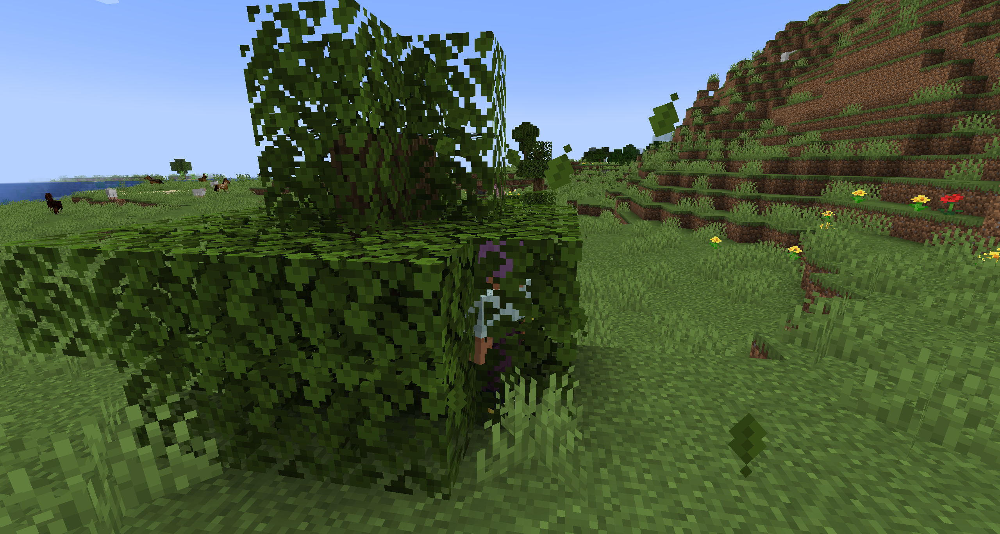
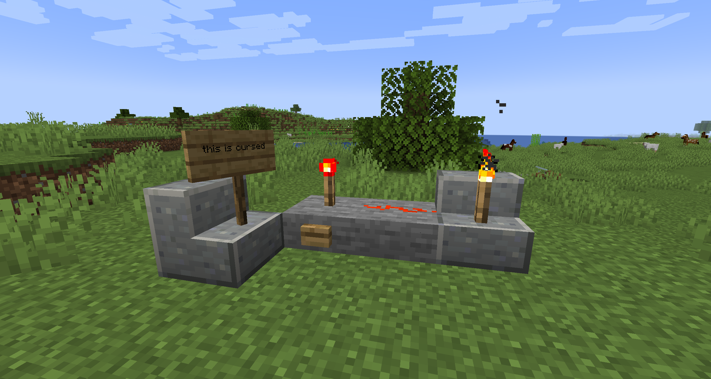
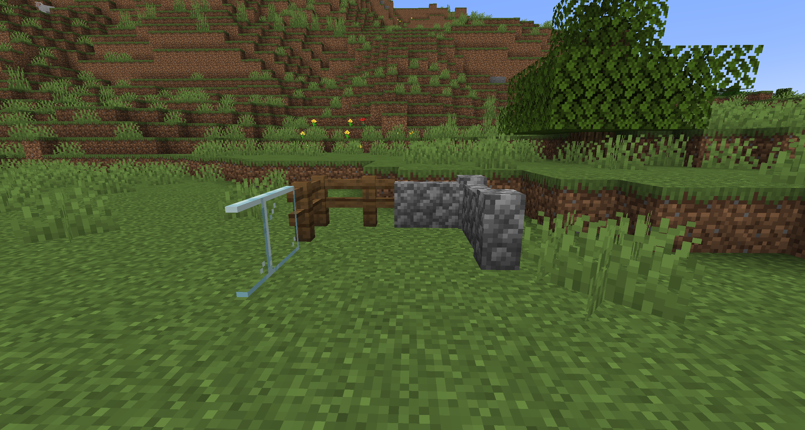
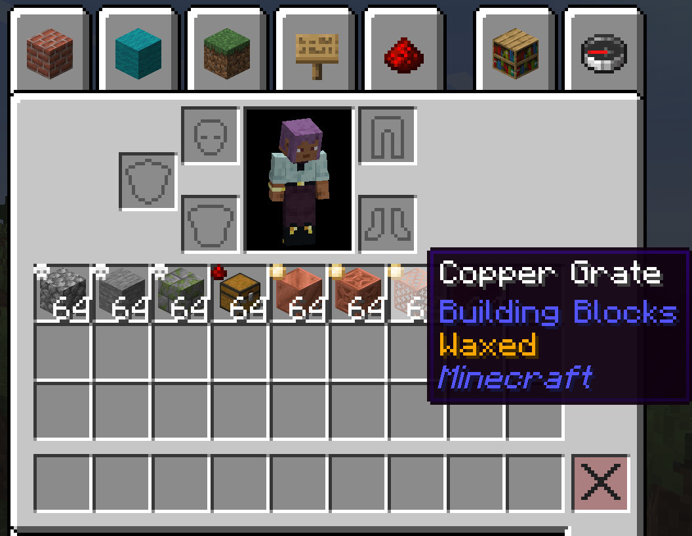

# Modulation

**Modulation** is a growing collection of handy quality-of-life tweaks, bug fixes, visual improvements, and cross-mod integrations. Instead of cluttering your modpack with a dozen single-feature mods, Modulation packs them all into one highly customizable package.

Everything is completely modular, so you can turn off whatever you don't need and tweak options to match your modpack!

---

## Features

### Passable Foliage & Leaf Effects

Walk seamlessly through foliage with customizable movement mechanics and visual effects!

* Walk through leaf blocks with configurable movement drag (`base_drag` and `max_drag`).
* Enable or disable passable behavior per leaf type (Pale Oak, Tinted Leaves, Tinted Needles, Cherry Leaves, etc.).
* Dynamic leaf rustling sound effects and leaf/cherry petal particles as entities pass through leaves (with optional *Vanilla Backport* integration).

---

### Block Grid & Surface Offsets

Precision placement and sub-block surface snapping for decorations and redstone components!

* Place blocks like lanterns, torches, flower pots, redstone wire, repeaters, and comparators on top of slabs and stairs snapped to 1/16th sub-block grid offsets.
* Signs click-snap to exact 1/16th grid offsets on surfaces.
* Item frames and paintings snap to sub-block surface edge offsets.
* Offset redstone components conduct signals properly and blocks survive on partial support surfaces.
* Toggle individual offset features (slab offsets, sign offsets, hanging entity offsets, particle offsets, block entity offsets, etc.) in the config menu.

_I was at house eating dorito when phone ring: block grid is kil_

---

### Walls & Connections

Enhanced fence, wall, and pane connecting logic ported from *BetterWalls*!

* Wall blocks visually connect to adjacent wood and nether fences.
* Fences connect smoothly to nearby wall blocks and iron bars.
* Iron bars and glass panes extend connections to wooden fences.
* Customize or disable each connection rule individually in the configuration.

---

### Tooltips & Visual Overlays

Clear visual indicators and info tooltips for items in your inventory!

* Honeycomb icon overlay on waxed copper block items in your inventory.
* Visual icon overlays on Trapped Chests (redstone indicator) and Infested Blocks (silverfish indicator), fully customizable via item tags (`modulation:infested`, `modulation:trapped`, and blacklist tags).
* Enhanced copper item tooltips showing oxidation state (Oxidized, Weathered, Exposed, Waxed) and waxing status.
* Palette adjustments for softer, prettier map colors.

---

### Reconnectible Chains Integration

Build and traverse your world with ease using new chain-focused tools! *(Requires [Connectible Chains](https://modrinth.com/mod/connectible-chains))*

* Hold right-click with the Chain Staff to charge up and cast chains or posts from afar.
* Specialized Cast Post block supporting directional placement and waterlogging.
* Shift + Right-Click with the staff to switch to Zipline mode and ride ziplines (when paired with [Ziplines Rezipped!](https://modrinth.com/mod/ziplines-rezipped)).
* Fully configurable charge-up times, durability loss, and optional inventory chain requirement.

---

### Figura Enhancements

Upgrade your avatar management experience with [Figura](https://modrinth.com/mod/figura)!

* Support for vanilla target selectors like `@a`, `@p`, `@s`, or `@e` in `/figura load` and `/figura clear` commands, letting you update skins for multiple players simultaneously.
* Tab-completion autofill for local skins saved in your `figura/avatars` folder (both folders and `.zip` files).

---

### Anvil Tweaks

Options to customize anvil mechanics:

* Removes the annoying "Too Expensive!" 40-level limit on anvils.
* Configure zero experience costs for combining enchantments.
* Configure zero experience costs for repairing items or combining damaged tools.
* Configure zero experience costs for renaming items.

May need configuring to work with Allurement. Won't work with Easy Anvils.

---

### GUI & Controls

User interface and control QoL improvements:

* Hold Control while clicking or dragging items in your inventory to transfer them straight into the crafting grid. Works best when pairsed with [Mouse Tweaks](https://modrinth.com/mod/mouse-tweaks).
* Option to remove/disable the Creative inventory tab.
* Customize how long chat messages stay on screen before fading.

---

### Gameplay Tweaks

Small gameplay tweaks that make survival feel more natural. Inspired by Forgery/Fabrication!

* Cobwebs can catch fire and burn away like other flammable blocks.
* Campfires place down unlit by default and must be ignited using flint & steel.

---

### Bug & Performance Fixes

Fixes for several bugs and performance issues in base Minecraft:

* Fixes an exponential density function memoization bug in worldgen math (MC-268145), giving around a ~30% world generation speed boost when using terrain mods like Tectonic!
* Prevents buttons and sliders from keeping keyboard focus after being clicked (MC-259387).
* Lets you hit villagers who are sleeping in beds (MC-148559).
* Prevents experience levels from disappearing when traveling between dimensions without portals (MC-124177).
* Fixes `pack.mcmeta` datapack filters leaking across different namespaces (MC-271761).

---

## Wiki & Documentation

Want the full details on each module? Check out our **[Wiki](https://moddedmc.wiki/en/project/modulation/latest/docs)**!

---

## License

 

If you are thinking about using the code or assets from Modulation, please note the mod's licensing. All assets of Modulation are all rights reserved by their respective creators, unless specified otherwise. The source code of the mod is available under the MIT license, with the exception of the Vanilla Walls module which is licensed under AGPL-3.0-only.

---

## Credits

* Textures and original concepts for the Reconnectible Chains module come from [Nekomaster](https://www.curseforge.com/members/nekomaster1000) and were originally created for the modpack [Resurvival](https://www.curseforge.com/minecraft/modpacks/resurvival)!
* The improved tooltips feature is modified from [The Copperier Age](https://modrinth.com/mod/the-copperier-age).
* The Vanilla Walls module's wall/fence/pane connection logic is ported from [BetterWalls](https://modrinth.com/mod/betterwalls) by Lemonnik6484 and JX_Snack, licensed under AGPL-3.0-only.
* The creative inventory removal is modified from [Raspberry Core](https://modrinth.com/mod/raspberry-core), used under its MIT license.
* The passable foliage feature is modified from [Soft Leaves](https://modrinth.com/mod/soft-leaves), used under its MIT license.

---
 